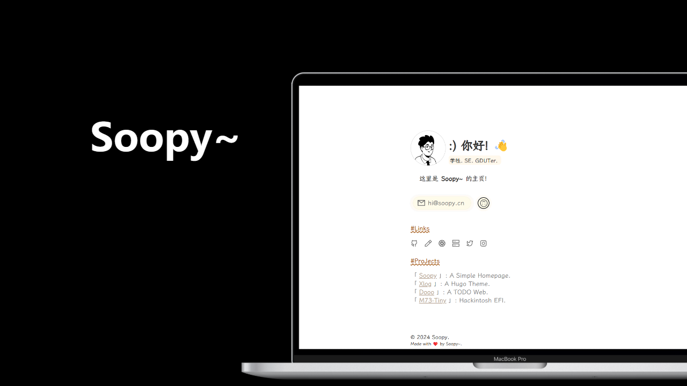

# Soopy

This is a `Simple & Lightweight` homepage.

Demo: https://lin-snow.github.io/Soopy

# Usage
1. download the source code from the release .
2. custom the essential files . eg: index.html...
3. deploy to the server.

